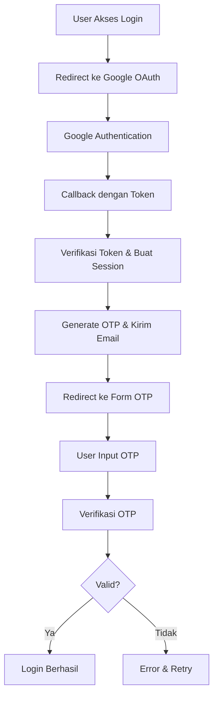
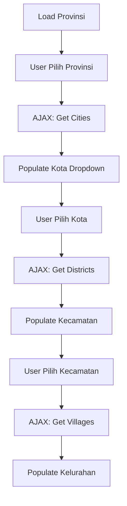
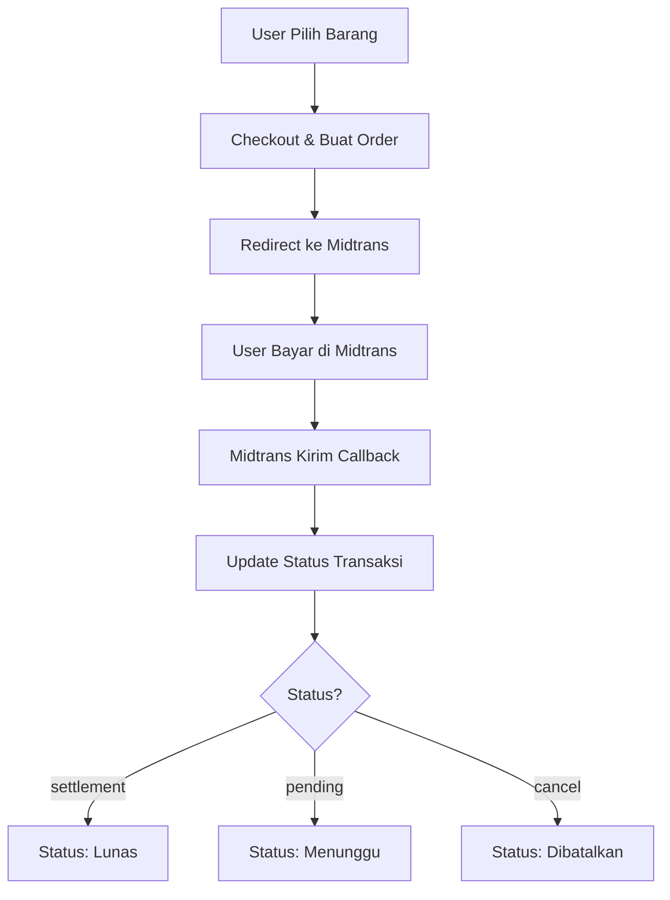

# 📚 Dokumentasi Lengkap Proyek Laravel: Koleksi Buku (Modul 1-7)

Selamat datang di dokumentasi teknis proyek **Koleksi Buku** berbasis Laravel! Dokumentasi ini dirancang sebagai kitab belajar komprehensif untuk presentasi, dengan fokus mendalam pada aspek teknis terutama di Modul 4 (jQuery & DOM) dan Modul 5 (AJAX & Axios).

## 🎯 Struktur Modul

### Modul 1 & 2: Arsitektur Proyek
### Modul 3: Database & Trigger
### Modul 4: **DEEP DIVE** - jQuery & DOM Manipulation
### Modul 5: **DEEP DIVE** - AJAX & Axios
### Modul 6 & 7: Integrasi Lanjutan

---

## 🏗️ Modul 1 & 2: Arsitektur Proyek

### 1.1 Struktur @section dan @stack (Global vs Page Style/Script)

Laravel Blade menggunakan sistem **@section** dan **@stack** untuk mengelola layout yang fleksibel. Ini memungkinkan pemisahan antara layout global dan konten spesifik halaman.

#### Konsep Dasar:
- **@section**: Digunakan untuk mengganti konten di layout induk
- **@stack**: Digunakan untuk menambahkan konten tambahan (CSS/JS) tanpa mengganti

#### Global vs Page-Specific:

```blade
<!-- resources/views/layouts/app.blade.php -->
<!DOCTYPE html>
<html>
<head>
    <title>@yield('title', 'Default Title')</title>

    <!-- Global Styles -->
    @stack('styles')
    <link href="{{ asset('css/global.css') }}" rel="stylesheet">

    @yield('head')
</head>
<body>
    @yield('content')

    <!-- Global Scripts -->
    @stack('scripts')
    <script src="{{ asset('js/global.js') }}"></script>
</body>
</html>
```

```blade
<!-- resources/views/admin/dashboard.blade.php -->
@extends('layouts.app')

@section('title', 'Dashboard Admin')

@push('styles')
<link href="{{ asset('css/admin-specific.css') }}" rel="stylesheet">
@endpush

@section('content')
<h1>Dashboard</h1>
@endsection

@push('scripts')
<script src="{{ asset('js/admin-dashboard.js') }}"></script>
@endpush
```

#### Perbedaan Kritis:
| Aspek | @section | @stack |
|-------|----------|--------|
| **Penggunaan** | Mengganti konten layout | Menambahkan konten tambahan |
| **Global** | Bersifat overriding | Akumulatif |
| **CSS/JS** | @yield('styles') | @stack('styles') |
| **Fleksibilitas** | Satu konten per section | Multiple additions |

### 1.2 Alur Integrasi Google OAuth dan OTP Email

Sistem keamanan menggunakan **multi-layer authentication** dengan Google OAuth sebagai primary login dan OTP Email sebagai secondary verification.

#### Alur Lengkap:



#### Implementasi Kode:

```php
// routes/web.php
Route::get('/auth/google', [GoogleController::class, 'redirect']);
Route::get('/auth/google/callback', [GoogleController::class, 'callback']);

// app/Http/Controllers/Auth/GoogleController.php
public function callback(Request $request)
{
    $googleUser = Socialite::driver('google')->user();

    $user = User::updateOrCreate([
        'google_id' => $googleUser->id,
    ], [
        'name' => $googleUser->name,
        'email' => $googleUser->email,
    ]);

    // Generate OTP
    $otp = rand(100000, 999999);
    $user->otp = $otp;
    $user->save();

    // Kirim Email OTP
    Mail::to($user->email)->send(new OtpMail($otp));

    Auth::login($user);

    return redirect('/otp');
}
```

#### OTP Verification:

```php
// app/Http/Controllers/OtpController.php
public function verify(Request $request)
{
    $request->validate(['otp' => 'required|digits:6']);

    if ($request->otp == auth()->user()->otp) {
        auth()->user()->update(['otp' => null]);
        return redirect('/dashboard');
    }

    return back()->withErrors(['otp' => 'OTP tidak valid']);
}
```

---

## 🗄️ Modul 3: Database & Trigger

### 3.1 Logika trigger_id_barang untuk Format ID Unik

Trigger database digunakan untuk menghasilkan ID unik dengan format tertentu sebelum insert record.

#### Format ID: `BRG-{YYYYMMDD}-{SEQUENCE}`

```sql
DELIMITER //
CREATE TRIGGER trigger_id_barang BEFORE INSERT ON barang
FOR EACH ROW
BEGIN
    DECLARE next_seq INT DEFAULT 1;
    DECLARE date_str VARCHAR(8);

    SET date_str = DATE_FORMAT(NOW(), '%Y%m%d');

    -- Cari sequence terakhir untuk tanggal hari ini
    SELECT COALESCE(MAX(CAST(SUBSTRING(id_barang, 13) AS UNSIGNED)), 0) + 1
    INTO next_seq
    FROM barang
    WHERE id_barang LIKE CONCAT('BRG-', date_str, '-%');

    -- Generate ID baru
    SET NEW.id_barang = CONCAT('BRG-', date_str, '-', LPAD(next_seq, 4, '0'));
END//
DELIMITER ;
```

#### Contoh Output:
- `BRG-20260414-0001`
- `BRG-20260414-0002`
- `BRG-20260415-0001` (tanggal baru, reset sequence)

### 3.2 Algoritma Penempatan Label TnJ 108

Label TnJ 108 menggunakan grid 5 kolom × N baris untuk penempatan otomatis berdasarkan koordinat (X, Y).

#### Algoritma Perhitungan:

```php
// app/Http/Controllers/Admin/BarangController.php
public function cetak(Request $request)
{
    $ids = $request->barang;
    $x = $request->x; // Kolom (1-5)
    $y = $request->y; // Baris (1-N)

    // Hitung posisi mulai: (baris-1) * 5 + (kolom-1)
    $startIndex = (($y - 1) * 5) + ($x - 1);

    // Contoh: X=3, Y=2 → (2-1)*5 + (3-1) = 5 + 2 = 7
    // Posisi ke-7 dalam grid
}
```

#### Visualisasi Grid:

```
Baris 1: [1] [2] [3] [4] [5]
Baris 2: [6] [7] [8] [9] [10]
Baris 3: [11][12][13][14][15]
...
```

---

## 🎯 **DEEP DIVE: Modul 4 - jQuery & DOM Manipulation**

Modul ini fokus pada manipulasi DOM secara efisien tanpa reload halaman, dengan validasi form dan UX enhancement.

### 4.1 Tabel Perbandingan: HTML Biasa vs DataTables

| Aspek | Tabel HTML Biasa | DataTables (jQuery Plugin) |
|-------|------------------|----------------------------|
| **Rendering** | Server-side rendering | Client-side processing |
| **Pagination** | Manual dengan PHP | Otomatis dengan JavaScript |
| **Sorting** | Manual SQL ORDER BY | Klik header kolom |
| **Searching** | Manual form submit | Real-time filter |
| **Performance** | Baik untuk data kecil | Optimal untuk data besar |
| **UX** | Basic | Advanced (responsive, export) |
| **Dependencies** | None | jQuery + DataTables JS/CSS |

#### Implementasi DataTables:

```javascript
// resources/js/app.js
$(document).ready(function() {
    $('#barangTable').DataTable({
        "paging": true,
        "searching": true,
        "ordering": true,
        "responsive": true,
        "language": {
            "search": "Cari:",
            "lengthMenu": "Tampilkan _MENU_ data per halaman",
            "info": "Menampilkan _START_ sampai _END_ dari _TOTAL_ data"
        }
    });
});
```

### 4.2 Mengapa event.preventDefault() atau Tombol di Luar <form>

**event.preventDefault()** mencegah behavior default browser, memungkinkan custom handling via JavaScript.

#### Skenario Penggunaan:

```html
<!-- ❌ Tombol di dalam form (akan submit form) -->
<form id="myForm">
    <input type="text" name="nama">
    <button type="submit">Simpan</button> <!-- Auto-submit -->
</form>

<!-- ✅ Tombol di luar form + preventDefault -->
<form id="myForm">
    <input type="text" name="nama">
</form>
<button id="btnSimpan">Simpan</button>

<script>
$('#btnSimpan').click(function(event) {
    event.preventDefault(); // ❌ Cegah submit otomatis

    // ✅ Custom logic: AJAX submit
    $.ajax({
        url: '/submit',
        method: 'POST',
        data: $('#myForm').serialize(),
        success: function(response) {
            console.log('Data tersimpan!');
        }
    });
});
</script>
```

#### Alasan Teknis:
1. **Kontrol Penuh**: Developer kontrol kapan dan bagaimana submit
2. **Validasi Custom**: Cek validasi sebelum submit
3. **UX Enhancement**: Tampilkan loading spinner, disable button
4. **AJAX Integration**: Submit tanpa page reload

### 4.3 Validation-First: reportValidity() Sebelum Spinner

**Validation-First Approach** memastikan data valid sebelum menampilkan feedback visual.

```javascript
$('#btnSubmit').click(function(event) {
    event.preventDefault();

    const form = document.getElementById('myForm');

    // ✅ 1. Validasi dulu
    if (!form.reportValidity()) {
        return; // ❌ Stop jika invalid
    }

    // ✅ 2. Baru tampilkan spinner
    $('#spinner').show();
    $('#btnSubmit').prop('disabled', true);

    // ✅ 3. Submit via AJAX
    $.ajax({
        url: '/submit',
        method: 'POST',
        data: new FormData(form),
        success: function(response) {
            $('#spinner').hide();
            $('#btnSubmit').prop('disabled', false);
            alert('Berhasil!');
        },
        error: function() {
            $('#spinner').hide();
            $('#btnSubmit').prop('disabled', false);
            alert('Error!');
        }
    });
});
```

#### Flow Teknis:
1. **reportValidity()**: Trigger browser validation + show error messages
2. **Spinner Display**: Visual feedback untuk user
3. **AJAX Submit**: Asynchronous processing
4. **State Reset**: Hide spinner & enable button

### 4.4 jQuery DOM Manipulation: .text() vs .html()

jQuery mengubah konten elemen secara real-time tanpa database call.

```javascript
// ✅ Mengubah teks saja (aman dari XSS)
$('#totalHarga').text('Rp 150.000');

// ✅ Mengubah dengan HTML (berisiko XSS)
$('#status').html('<span class="badge badge-success">Lunas</span>');

// ❌ Berbahaya jika data dari user
$('#userInput').html(userInput); // XSS vulnerability!

// ✅ Aman: escape HTML
$('#userInput').text(userInput);
```

#### Perbedaan Kritis:

| Method | Content | XSS Risk | Use Case |
|--------|---------|----------|----------|
| `.text()` | Plain text | ❌ None | Display data |
| `.html()` | HTML markup | ⚠️ High | Rich formatting |
| `.val()` | Form values | ❌ None | Input fields |

### 4.5 CSS cursor: pointer untuk UX

```css
/* resources/css/app.css */
.btn-custom, .clickable-element {
    cursor: pointer; /* 👆 Menunjukkan elemen clickable */
    transition: opacity 0.3s ease;
}

.btn-custom:hover {
    opacity: 0.8;
}
```

#### Mengapa Penting:
- **Visual Cue**: User tahu elemen bisa diklik
- **Accessibility**: Screen readers recognize clickable elements
- **UX Consistency**: Standar web design

---

## 🚀 **DEEP DIVE: Modul 5 - AJAX & Axios**

Modul ini mengeksplorasi asynchronous communication untuk dynamic content loading.

### 5.1 Alur Select Berjenjang (Provinsi > Kota > Kecamatan > Kelurahan)

Implementasi cascading dropdown menggunakan AJAX untuk load data dinamis.

#### Alur Teknis:



#### Implementasi jQuery AJAX:

```javascript
// resources/views/admin/week4/wilayah.blade.php
$(document).ready(function() {
    $('#province').change(function() {
        const provinceId = $(this).val();

        $.ajax({
            url: '/get-cities',
            method: 'POST',
            data: { province_id: provinceId },
            success: function(data) {
                $('#city').html('<option value="">Pilih Kota</option>');
                data.forEach(city => {
                    $('#city').append(`<option value="${city.id}">${city.name}</option>`);
                });
            }
        });
    });

    // Chain untuk districts dan villages...
});
```

#### Controller Response:

```php
// app/Http/Controllers/Admin/WeekEmpat.php
public function getCities(Request $request)
{
    $cities = DB::table('regencies')
        ->where('province_id', $request->province_id)
        ->get();

    return response()->json($cities);
}
```

### 5.2 Perbandingan Sintaks: $.ajax vs Axios

| Aspek | $.ajax (Callback) | Axios (Promise/Then-Catch) |
|-------|-------------------|----------------------------|
| **Paradigm** | Callback-based | Promise-based |
| **Error Handling** | success/error callbacks | .then().catch() |
| **Chaining** | Nested callbacks | Method chaining |
| **Modern JS** | Legacy | ES6+ compatible |
| **Dependencies** | jQuery required | Standalone library |

#### Contoh Perbandingan:

```javascript
// ❌ jQuery AJAX (Callback Hell)
$.ajax({
    url: '/api/data',
    method: 'GET',
    success: function(response) {
        console.log('Success:', response);
        $.ajax({
            url: '/api/process',
            method: 'POST',
            data: { data: response },
            success: function(result) {
                console.log('Processed:', result);
            },
            error: function(xhr) {
                console.error('Process error');
            }
        });
    },
    error: function(xhr) {
        console.error('Data error');
    }
});

// ✅ Axios (Promise-based)
axios.get('/api/data')
    .then(response => {
        console.log('Success:', response.data);
        return axios.post('/api/process', { data: response.data });
    })
    .then(result => {
        console.log('Processed:', result.data);
    })
    .catch(error => {
        console.error('Error:', error.response?.data || error.message);
    });
```

### 5.3 response.json() di Controller & Akses Data di JavaScript

#### Controller Response Format:

```php
// app/Http/Controllers/Admin/WeekEmpat.php
public function findBarang(Request $request)
{
    $barang = DB::table('barang')
        ->where('id_barang', $request->kode)
        ->first();

    if ($barang) {
        return response()->json([
            'status' => 'success',
            'data' => $barang
        ]);
    } else {
        return response()->json([
            'status' => 'error',
            'message' => 'Barang tidak ditemukan'
        ]);
    }
}
```

#### JavaScript Data Access:

```javascript
// Menggunakan jQuery AJAX
$.ajax({
    url: '/find-barang',
    method: 'POST',
    data: { kode: 'BRG-20260414-0001' },
    success: function(response) {
        if (response.status === 'success') {
            // ✅ Akses data barang
            const nama = response.data.nama;        // "Buku Laravel"
            const harga = response.data.harga;      // 150000

            // Update DOM
            $('#namaBarang').text(nama);
            $('#hargaBarang').text('Rp ' + harga.toLocaleString());
        } else {
            alert(response.message);
        }
    }
});

// Menggunakan Axios
axios.post('/find-barang', { kode: 'BRG-20260414-0001' })
    .then(response => {
        const data = response.data; // Axios otomatis parse JSON

        if (data.status === 'success') {
            console.log('Barang:', data.data.nama);
        }
    })
    .catch(error => {
        console.error('Error:', error.response.data);
    });
```

---

## 🔗 Modul 6 & 7: Integrasi Lanjutan

### 6.1 Alur Payment Gateway (Midtrans)

Implementasi payment gateway untuk transaksi online dengan status tracking.

#### Flow Lengkap:



#### Implementasi Kode:

```php
// app/Http/Controllers/Guest/OrderController.php
public function payment($orderId)
{
    $order = Penjualan::find($orderId);

    // Konfigurasi Midtrans
    Config::$serverKey = config('midtrans.server_key');
    Config::$isProduction = false;

    $transaction = [
        'transaction_details' => [
            'order_id' => $order->id_penjualan,
            'gross_amount' => $order->total
        ],
        'customer_details' => [
            'name' => $order->customer_name,
            'email' => $order->customer_email
        ]
    ];

    $snapToken = Snap::getSnapToken($transaction);

    return view('payment', compact('snapToken', 'order'));
}

// Callback Handler
public function callback(Request $request)
{
    $orderId = $request->order_id;
    $status = $request->transaction_status;

    $order = Penjualan::where('id_penjualan', $orderId)->first();

    switch ($status) {
        case 'settlement':
            $order->status = 'lunas';
            break;
        case 'pending':
            $order->status = 'menunggu';
            break;
        case 'cancel':
            $order->status = 'dibatalkan';
            break;
    }

    $order->save();
}
```

### 6.2 Implementasi Barcode (1D) dan QR Code (2D)

Menggunakan library `picqer/php-barcode-generator` untuk generate barcode.

#### Barcode 1D (CODE128):

```php
// app/Http/Controllers/Admin/BarangController.php
use Picqer\Barcode\BarcodeGeneratorPNG;

public function generateBarcode($id)
{
    $generator = new BarcodeGeneratorPNG();
    $barcode = $generator->getBarcode($id, $generator::TYPE_CODE_128);

    return response($barcode)
        ->header('Content-Type', 'image/png');
}
```

#### QR Code 2D:

```php
use SimpleSoftwareIO\QrCode\Facades\QrCode;

public function generateQR($data)
{
    return QrCode::size(200)->generate($data);
}
```

### 6.3 Perbedaan Teknis: BLOB vs File Path

| Aspek | BLOB Storage | File Path Storage |
|-------|--------------|-------------------|
| **Storage** | Database binary field | Server file system |
| **Performance** | Lebih lambat untuk file besar | Lebih cepat |
| **Backup** | Included in DB backup | Separate file backup |
| **Scalability** | Database size bloat | File system management |
| **Access** | Via PHP script | Direct URL access |
| **Use Case** | Small files, security | Large files, public access |

#### Implementasi BLOB:

```php
// Migration
Schema::create('customers', function (Blueprint $table) {
    $table->binary('photo'); // BLOB field
});

// Controller Store
public function storeBlob(Request $request)
{
    $photo = $request->file('photo');
    $blob = file_get_contents($photo->getRealPath());

    Customer::create([
        'name' => $request->name,
        'photo' => $blob
    ]);
}

// Display
public function showPhoto($id)
{
    $customer = Customer::find($id);
    return response($customer->photo)
        ->header('Content-Type', 'image/jpeg');
}
```

#### Implementasi File Path:

```php
// Controller Store
public function storeFile(Request $request)
{
    $photo = $request->file('photo');
    $path = $photo->store('photos', 'public');

    Customer::create([
        'name' => $request->name,
        'photo_path' => $path
    ]);
}

// Display
photo_path) }}" alt="Photo">
```

---

## 🎉 Kesimpulan

Dokumentasi ini mencakup implementasi teknis lengkap dari proyek Laravel Koleksi Buku, dengan fokus khusus pada:

- ✅ Arsitektur Blade templating dengan @section/@stack
- ✅ Multi-layer authentication (Google OAuth + OTP)
- ✅ Database triggers untuk ID generation
- ✅ Algoritma positioning untuk label printing
- ✅ **Deep dive** jQuery DOM manipulation & validation
- ✅ **Deep dive** AJAX/Axios untuk dynamic content
- ✅ Payment gateway integration dengan Midtrans
- ✅ Barcode & QR code generation
- ✅ File storage strategies (BLOB vs File Path)

**Happy Coding! 🚀📚**

In order to ensure that the Laravel community is welcoming to all, please review and abide by the [Code of Conduct](https://laravel.com/docs/contributions#code-of-conduct).

## Security Vulnerabilities

If you discover a security vulnerability within Laravel, please send an e-mail to Taylor Otwell via [taylor@laravel.com](mailto:taylor@laravel.com). All security vulnerabilities will be promptly addressed.

## License

The Laravel framework is open-sourced software licensed under the [MIT license](https://opensource.org/licenses/MIT).
